 

 

### Who I Am

I am a full-stack developer and AI engineer. I focus on building web applications and integrating machine learning models into software systems.

I work across the stack, using React and Next.js for front-end development, and FastAPI, Node.js, and Laravel for backend services. Lately, I have been spending more time connecting LLMs and other AI tools to existing application workflows.

### What I Build

I build tools, APIs, and web applications that solve specific problems. Some of my recent projects include video translation tools, automated code review assistants, and mock API sandboxes for developers.

When building software, I focus on writing clean code, handling errors properly, and making sure the system works reliably under normal use.

 

<!-- EchoX -->

  <picture>
    <source media="(min-width: 769px)" srcset="./assets/projects/cover-echox.svg" width="280" />
    <source media="(max-width: 768px)" srcset="./assets/projects/cover-echox.svg" width="100%" />
    
  </picture>
 <b>EchoX</b>
  
  An application that translates and dubs videos. It automates transcription, translation, and voice synthesis to generate translated audio and subtitles for uploaded files or YouTube links.  
  <code>React</code> <code>FastAPI</code> <code>Tauri</code> <code>Docker</code> <code>Gemini</code>  
  <a href="https://github.com/PraveenAmujuri/ai_video_translator">View repository ↗</a> &nbsp;·&nbsp; <a href="https://echox.praveenai.tech">Live demo ↗</a>

   

<!-- PRISM -->

  <picture>
    <source media="(min-width: 769px)" srcset="./assets/projects/cover-prism.svg" width="280" />
    <source media="(max-width: 768px)" srcset="./assets/projects/cover-prism.svg" width="100%" />
    
  </picture>
  <b>PRISM</b>
  
  A tool that uses language models to automate code reviews on pull requests. It performs compliance checks, generates documentation, and suggests improvements for code changes.  
  <code>React</code> <code>Node.js</code> <code>AI Agents</code> <code>GitHub API</code>  
  <a href="https://github.com/PraveenAmujuri/prism">View repository ↗</a> &nbsp;·&nbsp; <a href="https://prism.praveenai.tech">Live demo ↗</a>

   

<!-- MockForge -->

  <picture>
    <source media="(min-width: 769px)" srcset="./assets/projects/cover-mockforge.svg" width="280" />
    <source media="(max-width: 768px)" srcset="./assets/projects/cover-mockforge.svg" width="100%" />
    
  </picture>
  <b>MockForge</b>
  
  A platform for mocking REST APIs and creating sandbox endpoints. It includes request logging, API key management, and latency simulation to help developers test integrations.  
  <code>Next.js</code> <code>NestJS</code> <code>PostgreSQL</code> <code>Prisma</code>  
  <a href="https://github.com/PraveenAmujuri/MockForge">View repository ↗</a> &nbsp;·&nbsp; <a href="https://mock.praveenai.tech">Live demo ↗</a>

   

<!-- MediStream AI -->

  <picture>
    <source media="(min-width: 769px)" srcset="./assets/projects/cover-medistream.svg" width="280" />
    <source media="(max-width: 768px)" srcset="./assets/projects/cover-medistream.svg" width="100%" />
    
  </picture>
  <b>MediStream AI</b>
  
  A web application for hospital triage and appointment scheduling. It uses language models to analyze symptoms, calculate urgency scores, and schedule appointments based on priority.  
  <code>React</code> <code>FastAPI</code> <code>MongoDB</code> <code>Gemini</code>  
  <a href="https://github.com/PraveenAmujuri/medistream-ai-hospital-booking">View repository ↗</a> &nbsp;·&nbsp; <a href="https://med.praveenai.tech">Live demo ↗</a>

   

<!-- CareerDNA -->

  <picture>
    <source media="(min-width: 769px)" srcset="./assets/projects/cover-careerdna.svg" width="280" />
    <source media="(max-width: 768px)" srcset="./assets/projects/cover-careerdna.svg" width="100%" />
    
  </picture>
  <b>CareerDNA</b>
  
  A career helper application built with Python and TensorFlow. It analyzes resumes against job descriptions, scores practice interviews, and recommends learning paths.  
  <code>Python</code> <code>TensorFlow</code> <code>Flask</code> <code>Scikit-learn</code>  
  <a href="https://github.com/PraveenAmujuri/careerdna">View repository ↗</a> &nbsp;·&nbsp; <a href="https://career.praveenai.tech">Live demo ↗</a>

   

<!-- LunaBot -->

  <picture>
    <source media="(min-width: 769px)" srcset="./assets/projects/cover-lunabot.svg" width="280" />
    <source media="(max-width: 768px)" srcset="./assets/projects/cover-lunabot.svg" width="100%" />
    
  </picture>
  <b>LunaBot</b>
  
  A prototype simulation of a lunar rover built with Unity and ROS. It uses YOLOv8 and SLAM to navigate environments and map objects in real-time.  
  <code>Python</code> <code>Unity</code> <code>ROS</code> <code>YOLOv8</code>  
  <a href="https://github.com/PraveenAmujuri/LunaBot_Prototype">View repository ↗</a>

  

 

 

Lately, I have been focused on learning and building projects with **LLMs, RAG, MCP, LangGraph, and Multi-Agent Systems**. I am also studying **System Design, Distributed Systems, and Microservices** to understand how to build systems that scale. Additionally, I am exploring MLOps tools like **Docker, MLOps frameworks, and CI/CD pipelines** to learn how to deploy and manage models in production.

 

  

<a href="https://www.linkedin.com/in/sai-praveen-amujuri-738bb4358/" target="_blank"> LinkedIn</a> &nbsp;·&nbsp; 
<a href="https://www.praveenai.tech" target="_blank"> Portfolio</a> &nbsp;·&nbsp; 
<a href="mailto:saipraveenamujuri@gmail.com"> Email</a> &nbsp;·&nbsp; 
<a href="https://www.kaggle.com/praveen77744" target="_blank"> Kaggle</a>

  

If you'd like to collaborate, discuss a project, or just connect, feel free to reach out.

 

<!-- Profile views tracking pixel -->

